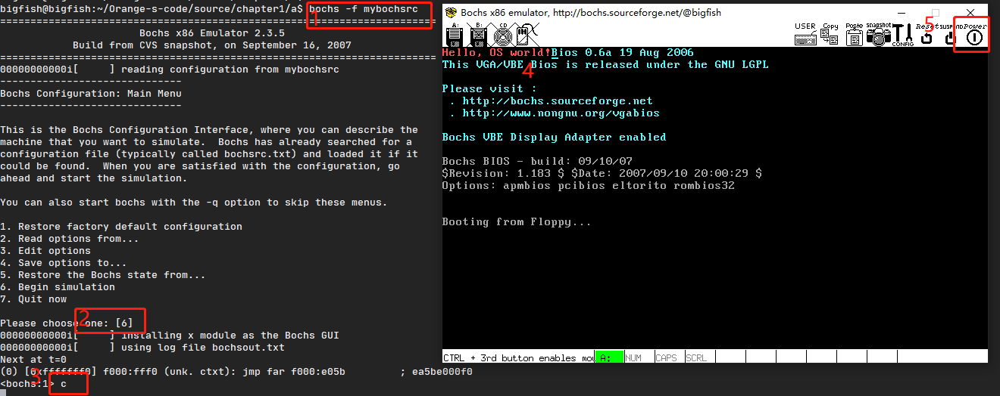

# 马上动手写一个最小的”操作系统“

## nasm 安装

`sudo apt-get install nasm`

## 编译

`nasm boot.asm -o boot.bin`

``` bash
bigfish@bigfish:~/Orange-s-code/source/chapter1/a$ nasm boot.asm -o boot.bin
bigfish@bigfish:~/Orange-s-code/source/chapter1/a$ ls
bochsrc  boot.asm  boot.bin
```

## bochs 运行

### 制作镜像

1.生成镜像文件

`bximage`

第一步选 fd, 其余默认
生成软盘镜像 a.img

2.写入引导扇区

`dd if=boot.bin of=a.img bs=512 count=1 conv=notrunc`

### 生成 mybochsrc 

``` shell
#how much memory the emulated machine will have
megs: 32

#filename of ROM images
romimage: file=$BXSHARE/BIOS-bochs-latest
vgaromimage: file=$BXSHARE/VGABIOS-lgpl-latest

#what disk images will be used
floppya: 1_44=a.img, status=inserted

#choose the boot disk
boot: floppy

#where do we send log messages?
log: bochsout.txt

#disable the mouse
mouse: enabled=0

#enable key mapping, using US layout as default.
keyboard_mapping: enabled=1, map=$BXSHARE/keymaps/x11-pc-us.map

```

### 运行

`bochs -f mybochsrc`

- 输入回车
- 调试界面输入 c 回车， 运行
- 红色 Hello, OS world!
- 按 Power 退出

### 截图


