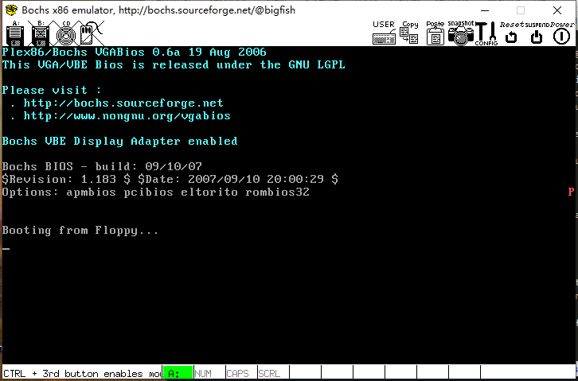
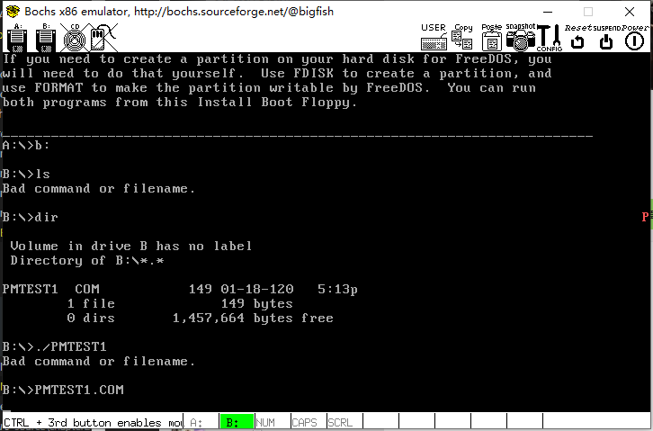

# 进入保护模式

## pmtest1_1.asm 运行

使用环境 ubuntu12.04 + bochs2.3.5

pmtest1_1.asm 即为原书程序。

```bash
nasm pmtest1_1.asm -o pmtest1.bin
cp ../../chapter2/linux/a.img .
dd if=pmtest1.bin of=a.img bs=512 count=1 conv=notrunc
bochs -f bochsrc_a
```

*注意* 第二步需要使用上一章生成的最终的 a.img 文件，因为pmtest1_1.asm 没有定义可引导标识 0x55aa

## freedos 运行 com 文件

使用环境 ubuntu16.04

1. 建立工作目录

2. freedos 镜像
  - tar vxzf freedos.img.tar.gz
  - cd freedos.img
  - a.img 重命名为 freedos.img
  - 拷贝到工作目录

3. bximage 在工作目录下生成新的软盘印象: pm.img

4. 修改 bochsrc 配置文件，

```ini
floppya: 1_44="freedos.img", status=inserted
floppyb: 1_44="pm.img", status=inserted
boot: a
```
5. 格式化 pm.img
  因为现在 pm.img 上没有文件系统，需要格式化为 dos 文件系统
  - bochs  -f  bochsrc
  - 6-c-回车
  - dos 启动,此时 pm.img 作为软驱加载到 b:
  - dos 下 运行 `format b:`

6. 编译 pmtest1.asm
  将 pmtest1.asm 中的0x7c00改为0100h,重新编译
  nasm pmtest1.asm -o pmtest1.com

7. 将pmtest1.com复制到虚拟软驱pm.img中 在linux下进行
  >  在类 UNIX 系统里，loop 设备是一种伪设备(pseudo-device)，或者也可以说是仿真设备。它能使我们像块设备一样访问一个文件。

  >  在使用之前，一个 loop 设备必须要和一个文件进行连接。这种结合方式给用户提供了一个替代块特殊文件的接口。因此，如果这个文件包含有一个完整的文件系统，那么这个文件就可以像一个磁盘设备一样被 mount 起来。

  > 上面说的文件格式，我们经常见到的是 CD 或 DVD 的 ISO 光盘镜像文件或者是软盘(硬盘)的 *.img 镜像文件。通过这种 loop mount (回环mount)的方式，这些镜像文件就可以被 mount 到当前文件系统的一个目录下。

  > 至此，顺便可以再理解一下 loop 之含义：对于第一层文件系统，它直接安装在我们计算机的物理设备之上；而对于这种被 mount 起来的镜像文件(它也包含有文件系统)，它是建立在第一层文件系统之上，这样看来，它就像是在第一层文件系统之上再绕了一圈的文件系统，所以称为 loop。 

  - 使用 losetup将磁盘镜像文件虚拟成块设备
    sudo losetup /dev/loop1 pm.img
  
  - mkdir /mnt/floopy

  - 挂载块设备
    mount /dev/loop1 /mnt/floopy

  - 复制文件
    sudo cp pmtest1.com /mnt/floppy/
  
  - sudo umount /mnt/floppy

  - sudo losetup -d /dev/loop1 

  此时文件 pmtest1.com 已经复制到 pm.img

8. freedos 下运行 pmtest1.com
  - cd b:
  - pmtest1.com

